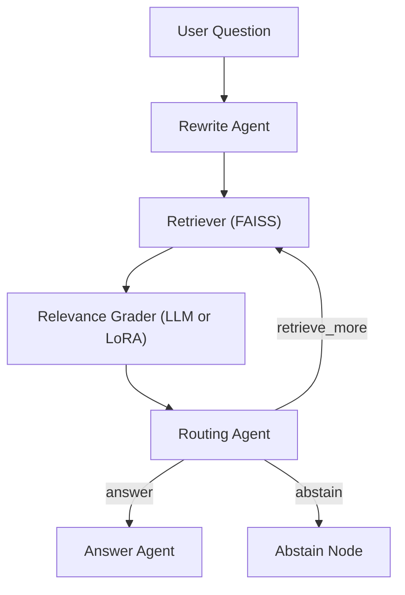

# Agentic RAG for News Intelligence (LoRA + LangGraph)

Production-style retrieval-augmented QA system over AG News with an explicit multi-agent workflow, LoRA-based relevance filtering, and reproducible side-by-side evaluation.

## Why This Project

This repository explores a common LLM product problem: fluent answers that are weakly grounded.
To address that, it combines:

- Query rewriting for retrieval quality
- Vector search over a curated news archive (FAISS)
- Document relevance grading (LLM or LoRA adapter)
- Route decisions (`retrieve_more`, `answer`, `abstain`) based on evidence sufficiency
- Confidence-aware final responses

The result is an end-to-end agentic RAG pipeline you can run, inspect, and benchmark.

## System Architecture



Core implementation lives in `stitching_system.py` via a compiled LangGraph state machine.

## Key Features

- Multi-agent orchestration with explicit state transitions
- Pluggable relevance grading:
  - `advanced_base`: LLM-based relevance grader
  - `advanced_lora`: LoRA fine-tuned relevance judge
- Four-mode evaluation harness for apples-to-apples comparison:
  - `base_llm`
  - `basic_rag`
  - `advanced_base`
  - `advanced_lora`
- Artifact generation for reproducibility:
  - tabular outputs (`comparison_outputs.csv`)
  - qualitative report (`sample_outputs.md`)
  - graph export (`agent_graph.mmd`)

## Repository Structure

- `stitching_system.py`: LangGraph workflow, retrieval, grading, routing, and execution modes
- `train_lora.py`: trains LoRA relevance adapter on AG News-derived relevance pairs
- `evaluate.py`: runs benchmark questions across all modes and exports artifacts
- `app.py`: CLI interface for interactive querying
- `run_full_pipeline.py`: one-command train + evaluate pipeline
- `requirements.txt`: project dependencies

## Quickstart

1. Install dependencies:
   ```bash
   pip install -r requirements.txt
   ```
2. Set OpenAI key:
   ```powershell
   $env:OPENAI_API_KEY="your_openai_api_key"
   ```
3. Run full pipeline:
   ```bash
   python run_full_pipeline.py
   ```

Dataset is downloaded automatically from [AG News](https://huggingface.co/datasets/ag_news).

## Reproducible Workflow

### Train LoRA relevance adapter

```bash
python train_lora.py --output-dir artifacts/lora_agnews_relevance_adapter --train-pairs 3000 --val-pairs 400 --max-steps 120
```

### Evaluate all modes

```bash
python evaluate.py --artifacts-dir artifacts --output-dir outputs --sample-size 3000
```

### Launch CLI

```bash
python app.py --artifacts-dir artifacts --mode advanced_base
```

## Benchmark Snapshot (Current Baseline)

From the current checked-in run (`outputs/comparison_outputs.csv`, 8 benchmark prompts):

| Mode | Avg Retrieval Rounds | Avg Retrieved Docs | Avg Relevant Docs | Low-Confidence Rate |
|---|---:|---:|---:|---:|
| `base_llm` | 0.00 | 0.0 | 0.000 | 0% |
| `basic_rag` | 0.00 | 6.0 | 0.000 | 0% |
| `advanced_base` | 1.12 | 8.5 | 4.375 | 0% |
| `advanced_lora` | 2.00 | 12.0 | 0.000 | 100% |

Interpretation:

- `advanced_base` shows stronger evidence selection and grounded answers.
- The checked-in `advanced_lora` adapter is conservative in this baseline run and tends to abstain/low-confidence; this makes it useful for surfacing failure modes and calibration opportunities.

## Recommended Model Settings

- Fast CPU demo: `sshleifer/tiny-gpt2` (default in `run_full_pipeline.py`)
- Better quality (recommended with GPU): `HuggingFaceTB/SmolLM2-360M-Instruct`

Example:

```bash
python train_lora.py --base-model-id HuggingFaceTB/SmolLM2-360M-Instruct --output-dir artifacts/lora_agnews_relevance_adapter --train-pairs 3000 --val-pairs 400 --max-steps 120
```

## Next Improvements

- Calibrate LoRA relevance thresholds and decoding for higher recall
- Add retrieval metrics (Precision@k / Recall@k / nDCG)
- Add automated regression tests for route and abstain behavior
- Add experiment tracking (seeded runs, config logging, result versioning)

## Output Artifacts

- `outputs/comparison_outputs.csv`
- `outputs/sample_outputs.md`
- `outputs/agent_graph.mmd`
